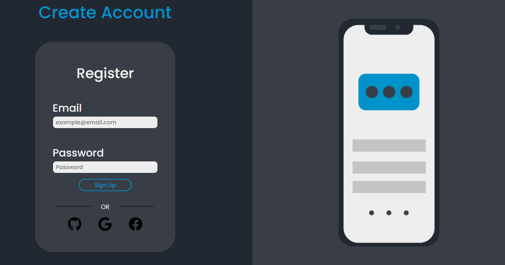

# Olá! Esse é meu primeiro projeto usando React.

## É apenas um teste para entender como funcionava os componentes, o sistemas de pastas e conceitos básicos no React.

&nbsp;

### Não há funcionalidades na aplicação, é apenas um formulário de cadastro básico.

&nbsp;

# Instalando as dependências e iniciando um servidor.

* Primeiramente para poder instalar as depedências do projeto abra o terminal dentro da pasta do projeto e rode o seguinte comando:
~~~
npm install
~~~

* Após ter instalado todas as dependências inicie um servidor node usando o comando:
~~~
yarn start
~~~
